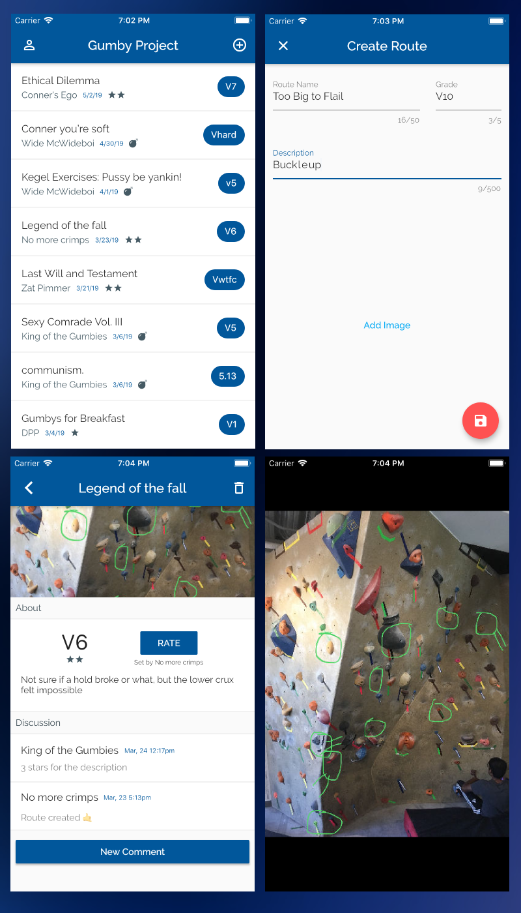

# Gumby Project

Mountain Project for Plastic

## Problem

At my college climbing gym we could only set six to ten established routes per week. This sounds like a lot, but these routes had to be spread amongst all difficulties which meant that, for your desired difficulty, you would have ~1-2 new routes per week. We would frequently climb 4-6 times per week, so having enough routes was often a limiting factor. In response, we created new routes by combining holds from pre-established routes. This is very common in climbing gyms, but we needed some way to document them because sometimes you were in class while your friends were making new routes! This was before apps like [Stokt](https://www.getstokt.com/) existed, so Gumby Project was born.

## Development

The app was built the weekend of the infamous [Polar Vortex](https://en.wikipedia.org/wiki/January%E2%80%93February_2019_North_American_cold_wave). This was the first time Notre Dame had cancelled class in over a decade; and I treated this free day as a mini-hackathon.

The app's architecture is based upon the [model-view-presenter](https://en.wikipedia.org/wiki/Model%E2%80%93view%E2%80%93presenter) pattern because the Firestore SDK's were all in their infancy and the streaming oriented architectures like BLoC were just surfacing. I'm using Firebase for data and Firebase storage for images.

## Screenshots

